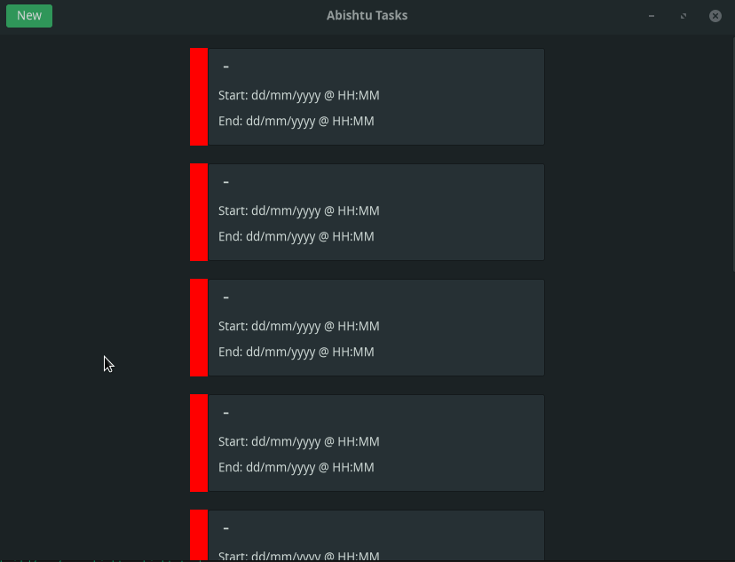
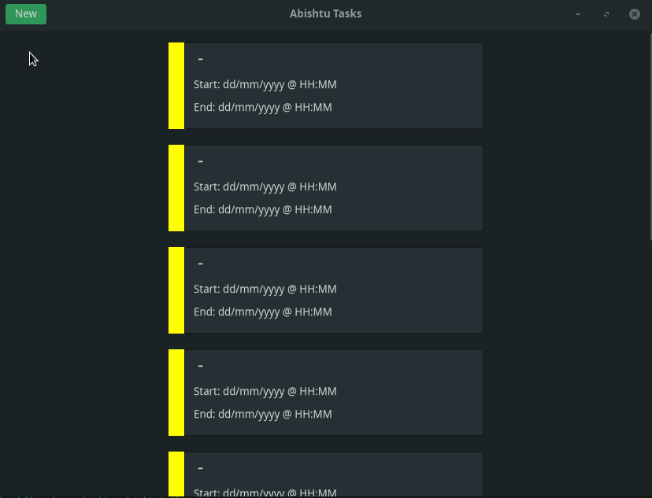

# Progress

## Fri Jul 2nd, 21:17:40 AEST

- The task widget with a colour has be made

- Pressing the new button changes the colour of the colour bar, this was
done to test if my colour update method works or not, more testing needs to be done though

- Header bar with a `New` button implemented

- A scrollable window

